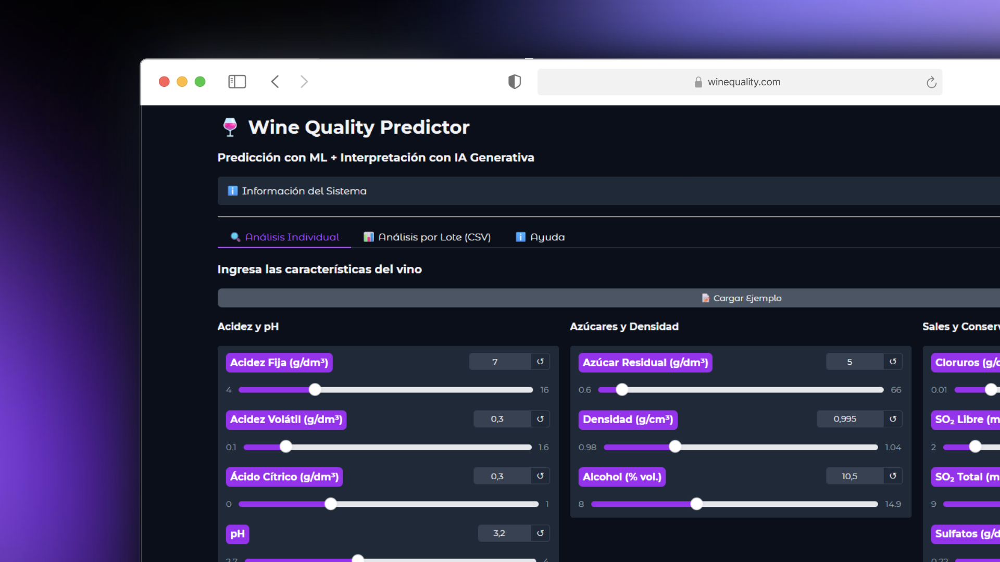

# 🍷 Wine Quality Predictor - MLOps Project

## 📋 Descripción

Sistema de predicción de calidad de vinos blancos que combina **Machine Learning** con **IA Generativa** para proporcionar predicciones precisas y explicaciones en lenguaje natural.

El proyecto implementa un pipeline MLOps completo con:
- **MLflow** para gestión y registro de modelos
- **Random Forest** como algoritmo de clasificación
- **Gemini AI** para generar explicaciones interpretables
- **Gradio** como interfaz de usuario interactiva

### ¿Qué hace?

Clasifica vinos blancos en dos categorías según sus características fisicoquímicas:
- **Alta Calidad**: puntuación ≥ 6/10
- **Baja Calidad**: puntuación < 6/10

Además de la predicción, el sistema genera explicaciones detalladas tipo sommelier que ayudan a entender **por qué** un vino fue clasificado de cierta manera.

---

## 🏗️ Estructura del Proyecto
```
WineQualityClassifierMLOps/
│
├── src/                          # Código fuente principal
│   ├── config/                   # Configuraciones centralizadas
│   │   ├── __init__.py
│   │   └── settings.py          # Config de MLflow, GenAI y App
│   │
│   ├── core/                     # Clientes de infraestructura
│   │   ├── __init__.py
│   │   ├── mlflow_client.py     # Cliente MLflow
│   │   └── genai_client.py      # Cliente GenAI (Gemini/OpenAI/Ollama)
│   │
│   ├── services/                 # Lógica de negocio
│   │   ├── __init__.py
│   │   ├── prediction_service.py      # Servicio de predicciones
│   │   └── interpretation_service.py  # Servicio de interpretación IA
│   │
│   ├── ui/                       # Interfaz de usuario
│   │   ├── __init__.py
│   │   └── gradio_app.py        # Aplicación Gradio
│   │
│   └── utils/                    # Utilidades
│       ├── __init__.py
│       ├── data_validator.py    # Validación de datos
│       └── formatters.py        # Formateo de salidas
│
├── data/                         # Datos del proyecto
├── mlruns/                       # Experimentos y modelos MLflow
├── mlartifacts/                  # Artefactos de MLflow
├── notebook/                     # Notebooks de entrenamiento
│
├── app.py                        # Punto de entrada principal
├── requirements.txt              # Dependencias Python
├── .env.example                  # Plantilla de variables de entorno
└── README.md                     # Este archivo
```

### 🎯 Arquitectura de Capas

El proyecto sigue una arquitectura en capas con **separación de responsabilidades**:

1. **Config** (`src/config/`): Configuración centralizada desde variables de entorno
2. **Core** (`src/core/`): Clientes de infraestructura (MLflow, GenAI)
3. **Services** (`src/services/`): Lógica de negocio (predicción e interpretación)
4. **UI** (`src/ui/`): Interfaz de usuario (Gradio)
5. **Utils** (`src/utils/`): Utilidades transversales

---

## 🚀 Instalación y Configuración

### 1. Requisitos Previos

- Python 3.8 o superior
- pip (gestor de paquetes Python)
- API Key de Google Gemini (obtenerla en [Google AI Studio](https://makersuite.google.com/app/apikey))

### 2. Clonar el Repositorio
```bash
git clone <url-del-repositorio>
cd WineQualityClassifierMLOps
```

### 3. Crear Entorno Virtual (Recomendado)
```bash
# Linux/Mac
python3 -m venv .venv
source .venv/bin/activate

# Windows
python -m venv .venv
.venv\Scripts\activate
```

### 4. Instalar Dependencias
```bash
pip install -r requirements.txt
```

### 5. Configurar Variables de Entorno

Crea un archivo `.env` en la raíz del proyecto:
```bash
cp .env.example .env
```

Edita `.env` y configura tu API key:
```env
# === GEMINI API ===
GEMINI_API_KEY=tu_api_key_aqui

# === MLFLOW CONFIG ===
MLFLOW_TRACKING_URI=http://127.0.0.1:5000
MODEL_NAME=wine-quality-classifier
MODEL_STAGE=Production

# === APP CONFIG ===
SERVER_HOST=0.0.0.0
SERVER_PORT=7860
DEBUG=False
```

---

## 📦 Dependencias Principales
```
# Machine Learning & MLOps
mlflow>=2.8.0              # Gestión de modelos
scikit-learn>=1.3.0        # Algoritmos ML
pandas>=2.0.0              # Manipulación de datos
numpy>=1.24.0              # Operaciones numéricas

# IA Generativa
google-generativeai>=0.3.0 # Cliente Gemini

# Interfaz de Usuario
gradio>=4.0.0              # UI interactiva

# Utilidades
python-dotenv>=1.0.0       # Variables de entorno
```

Ver archivo `requirements.txt` para la lista completa.

---

## 🎓 Entrenamiento del Modelo

Antes de ejecutar la aplicación, debes entrenar y registrar un modelo en MLflow:

### 1. Abrir el Notebook
```bash
jupyter notebook notebook/wine_quality_training.ipynb
```

### 2. Ejecutar Todas las Celdas

El notebook realizará:
- Carga y exploración de datos
- Preprocesamiento
- Entrenamiento de Random Forest
- Registro en MLflow Model Registry
- Transición a etapa "Production"

### 3. Verificar Modelo Registrado
```bash
# Iniciar UI de MLflow
mlflow ui --port 5000

# Acceder a http://localhost:5000
# Verificar que exista el modelo "wine-quality-classifier" en stage "Production"
```

---

## ▶️ Ejecución de la Aplicación

### Método 1: Ejecución Estándar
```bash
python app.py
```

### Método 2: Con Variables de Entorno Personalizadas
```bash
export GEMINI_API_KEY="tu_api_key"
export SERVER_PORT=8080
python app.py
```

### Salida Esperada
```
======================================================================
🍷 WINE QUALITY PREDICTOR - MLOps Project
======================================================================
Version: 1.0.0
======================================================================

✅ Environment validation passed
...
======================================================================
✅ Application ready!
======================================================================
📍 Access the app at: http://localhost:7860
======================================================================
```

### Acceder a la Aplicación

Abre tu navegador en: **http://localhost:7860**

---

## 🎨 Uso de la Interfaz

### 1️⃣ Análisis Individual

Permite analizar un vino específico:

1. **Ajustar valores** con los controles deslizantes
2. O hacer clic en **"📝 Cargar Ejemplo"** para valores predefinidos
3. Presionar **"🔮 Predecir Calidad"**
4. Obtener:
   - Predicción de calidad (Alta/Baja)
   - Nivel de confianza
   - Explicación generada por IA

**Ejemplo de salida:**
```
🍷✨ Alta Calidad (≥6)

Confianza: 87.3%

🤖 Explicación del Sommelier AI:
Este vino ha sido clasificado como de alta calidad debido principalmente 
a su equilibrado nivel de acidez fija (7.0 g/dm³) y su contenido alcohólico 
óptimo (10.5% vol.). Estos factores, combinados con niveles moderados de 
sulfatos (0.5 g/dm³), sugieren un vino bien estructurado con buena capacidad 
de conservación...
```

### 2️⃣ Análisis por Lote (CSV)

Permite analizar múltiples vinos simultáneamente:

1. Preparar un **CSV separado por `;`** con las 11 columnas requeridas
2. Subir el archivo
3. Presionar **"📈 Analizar Lote"**
4. Obtener:
   - Tabla con predicciones individuales
   - Estadísticas generales (% alta/baja calidad)
   - Análisis global generado por IA

**Formato del CSV:**
```csv
fixed acidity;volatile acidity;citric acid;residual sugar;chlorides;free sulfur dioxide;total sulfur dioxide;density;pH;sulphates;alcohol
7.0;0.27;0.36;20.7;0.045;45.0;170.0;1.001;3.0;0.45;8.8
6.3;0.30;0.34;1.6;0.049;14.0;132.0;0.994;3.3;0.49;9.5
```

---

## 🔧 Configuración Avanzada

### Usar Diferentes Proveedores de IA

El sistema soporta múltiples proveedores de IA generativa:

#### **Gemini (Predeterminado)**
```env
GENAI_PROVIDER=gemini
GEMINI_API_KEY=tu_api_key
GENAI_MODEL=gemini-2.5-flash
```

#### **OpenAI** (Requiere instalación adicional)
```bash
pip install openai
```
```env
GENAI_PROVIDER=openai
OPENAI_API_KEY=tu_api_key
GENAI_MODEL=gpt-4
```

#### **Ollama** (Modelos Locales)
```bash
# Instalar Ollama
curl -fsSL https://ollama.com/install.sh | sh

# Descargar modelo
ollama pull mistral
```
```env
GENAI_PROVIDER=ollama
GENAI_MODEL=mistral
```

### Configuración de MLflow

Para usar un servidor MLflow remoto:
```env
MLFLOW_TRACKING_URI=https://mlflow.tu-servidor.com
MODEL_NAME=tu-modelo
MODEL_STAGE=Production
```

---

## 📊 Features del Vino

El modelo espera **11 características fisicoquímicas**:

| Feature | Descripción | Unidad | Rango Típico |
|---------|-------------|--------|--------------|
| `fixed acidity` | Acidez fija (tartárico, málico) | g/dm³ | 4.0 - 16.0 |
| `volatile acidity` | Acidez volátil (acético) | g/dm³ | 0.1 - 1.6 |
| `citric acid` | Ácido cítrico | g/dm³ | 0.0 - 1.0 |
| `residual sugar` | Azúcar residual | g/dm³ | 0.6 - 66.0 |
| `chlorides` | Cloruros (salinidad) | g/dm³ | 0.01 - 0.35 |
| `free sulfur dioxide` | SO₂ libre (conservante) | mg/dm³ | 2.0 - 290.0 |
| `total sulfur dioxide` | SO₂ total | mg/dm³ | 9.0 - 440.0 |
| `density` | Densidad | g/cm³ | 0.98 - 1.04 |
| `pH` | Nivel de acidez | - | 2.7 - 4.0 |
| `sulphates` | Sulfatos | g/dm³ | 0.22 - 1.1 |
| `alcohol` | Contenido alcohólico | % vol. | 8.0 - 14.9 |

---

## 🧪 Testing y Desarrollo

### Ejecutar en Modo Debug
```bash
export DEBUG=True
python app.py
```

### Probar Conexión con GenAI
```python
from src.core import GenAIClient
from src.config import get_genai_config

client = GenAIClient()
print(client.test_connection())  # True si funciona
```

### Verificar Modelo MLflow
```python
from src.core import MLflowClient

client = MLflowClient()
info = client.get_model_info()
print(info)
```

---

## 🐛 Resolución de Problemas

### Error: "GEMINI_API_KEY not found"

**Solución:** Asegúrate de tener configurada la variable de entorno:
```bash
export GEMINI_API_KEY="tu_api_key_aqui"
```

### Error: "Could not load model"

**Soluciones:**
1. Verifica que hayas ejecutado el notebook de entrenamiento
2. Verifica que el modelo esté en stage "Production" en MLflow UI
3. Verifica la URI de MLflow en `.env`

### Error: "Missing required features"

**Solución:** Verifica que tu CSV tenga exactamente las 11 columnas requeridas y estén separadas por `;`

### La interfaz no carga

**Soluciones:**
1. Verifica que el puerto 7860 esté disponible
2. Cambia el puerto: `export SERVER_PORT=8080`
3. Verifica los logs en `app.log`

---

## 📚 Tecnologías Utilizadas

- **Python 3.8+**: Lenguaje principal
- **MLflow**: Gestión de experimentos y modelos
- **scikit-learn**: Algoritmos de Machine Learning
- **Random Forest**: Algoritmo de clasificación
- **Google Gemini AI**: IA generativa para explicaciones
- **Gradio**: Framework de UI interactiva
- **pandas**: Manipulación de datos
- **numpy**: Operaciones numéricas

---

## 🤝 Contribución

Las contribuciones son bienvenidas. Por favor:

1. Fork el proyecto
2. Crea una rama para tu feature (`git checkout -b feature/AmazingFeature`)
3. Commit tus cambios (`git commit -m 'Add AmazingFeature'`)
4. Push a la rama (`git push origin feature/AmazingFeature`)
5. Abre un Pull Request

---

## 👥 Autores

**Tobías Romero** y
**Jenifer Roa**

---